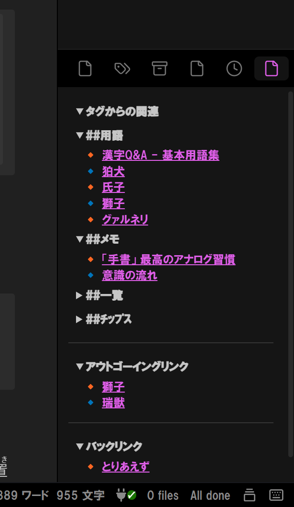

# 🧭 Related Notes View

Obsidianプラグイン「Related Notes View」は、**現在開いているノートに関連するノートを、サイドバーに視覚的に表示**するツールです。  
タグ・出リンク・バックリンクを自動で解析し、折りたたみ構造で整理表示します。



> 📝 本プラグインは [古村藍さんによる記事『ぼくがかんがえた最強のObsidian設定』](https://note.com/indigo372/n/nae1e72203c5b) に着想を得て制作されました。深く感謝申し上げます。

---

## 🔧 主な機能

- アクティブノートに対して：
  - ✅ 同一タグを持つノートを「タグごと」に表示（階層構造対応）
  - ✅ 出リンク（Outgoing）とバックリンク（Incoming）も表示
  - ✅ 各表示項目は `<details>` により折りたたみ可能
- ホバー表示・Ctrl/Cmdクリック対応
- タグ・リンクごとの最大表示件数を設定タブで制御可能

---

## 📁 表示セクションの構成

1. **タグからの関連ノート**
   - タグ階層（`#親/子/孫`）ごとにネスト表示
2. **出リンク（Outgoing Links）**
   - 対象ノートからリンクしている他ノート
3. **バックリンク（Backlinks）**
   - 対象ノートへリンクしている他ノート

---

## ⚙️ 設定可能な項目

| 項目 | 説明 |
|------|------|
| タグ構造のネスト表示 | 有効/無効 |
| 各種リンクの最大件数 | タグ別、出リンク、バックリンクそれぞれ個別に設定可 |
| ランダム表示 | ノート一覧をランダム順に表示 |
| 表示除外ノート | 特定ノートを非表示対象に設定可能 |
| スタイル調整 | フォントサイズ・行間など簡易カスタム可 |

---

## 📐 技術情報（開発者向け）

- Obsidian API
  - `metadataCache.getFileCache()` によるタグ/リンク情報取得
  - `MarkdownRenderer.renderMarkdown()` によるリンクのマークダウン描画
- HTML構造
  - `details > summary` 構造による折りたたみ対応
  - `ul > li > a` によるリンク表示
- CSSクラス（予定）
  - `.related-section`, `.tag-section`, `.even-item`, `.related-divider` 等を定義

---

## 🛠 インストール方法（手動）

1. [リリースページ](https://github.com/kinoko34077/obsidian-related-notes-view/releases) から最新版の `.zip` ファイルをダウンロード
2. 解凍して出てきたファイルを以下のフォルダにコピー：

```
[あなたのVault]/.obsidian/plugins/related-notes-view/
```

3. Obsidianを再起動するか、「設定 > プラグイン > コミュニティプラグイン」で「関連ノートビュー（Related Notes View）」を有効化

※ Obsidian 0.15.0以上が必要です

---

## 📌 今後の開発予定(気が向いたら遣ります)

- 表示順のカスタマイズ機能
- ノートのフィルター機能（タグ/パス/内容）
- CSSによるテーマカスタマイズ
- i18n（多言語対応）
- 右クリック対応

---

## 🧾 クレジット

- 🖋 インスピレーション元：[古村藍さんのnote記事](https://note.com/indigo372/n/nae1e72203c5b)
- 👤 制作・開発：KiNoTch.[Xリンク](https://x.com/kinokino3310427)

---

## 注意事項

- このプラグインはChatGPTを用いて作成しました｡構造や仕様が説明と厳密には異なる場合があります｡ご了承ください(2025/04/07)

## 🪪 ライセンス

MIT License
